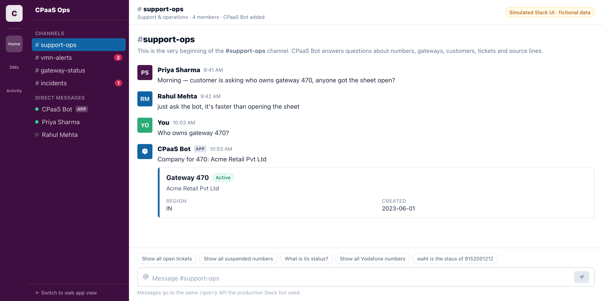

# CPaaS Support Bot

A conversational assistant that answers natural-language questions about CPaaS
operations data — virtual mobile numbers, gateways, customers, support tickets,
and SMPP/HTTP line configuration.

```
Priya Sharma   9:41 AM
  Morning — customer is asking who owns gateway 470, anyone got the sheet open?

You            9:59 AM
  @CPaaS Bot who owns gateway 470?

CPaaS Bot APP  9:59 AM
  Company for 470: Acme Retail Pvt Ltd
  ┌──────────────────────────────────────────┐
  │ Gateway 470  [active]                    │
  │ Acme Retail Pvt Ltd                       │
  │ REGION  IN        CREATED  2023-06-01     │
  └──────────────────────────────────────────┘

You            10:00 AM
  what is its status?

CPaaS Bot APP  10:00 AM  · resolved from context
  Status for 470: active
```



Support staff used to answer these questions by opening a Google Sheet, finding
the right tab, searching for an identifier, and cross-referencing other tabs for
every follow-up. This turns that into one question in a chat box.

> **About this repository.** I originally built this during my internship at
> **Netcore Cloud** in Mumbai, Maharashtra, where it was deployed as a Slack
> bot backed by the team's live Google Sheets. This repo is a standalone
> rebuild for portfolio use: all data in `data/` is fictional, no proprietary
> data or credentials are included, and the project runs entirely offline
> against bundled CSVs — no API keys, no database, no external services
> required.

---

## Quickstart

Nothing to configure — no API key, no `.env`, no database.

```bash
pip install -r requirements.txt
```

**Terminal:**

```bash
python app.py
```

**Web UI** — run the API and the frontend in two terminals:

```bash
uvicorn api:app --reload --port 8000
```

```bash
cd frontend && npm install && npm run dev
```

Then open <http://localhost:5173>. The Vite dev server proxies `/query` and
`/health` to the API on port 8000.

**Tests:**

```bash
python -m pytest tests/ -q
```

---

## Two interfaces

The bot is designed to live in **Slack**, so the demo opens on a Slack-style
workspace — that is the interface it was built for. A plain web chat view is
one click away in the sidebar if you want to see the same API driven a
different way.

The Slack view is a **faithful UI simulation, not a live Slack connection**:
it renders in the browser and talks to the same local `/query` endpoint. Every
bot reply in it is real — generated by the running backend against the demo
data, including the answer that appears when the channel first loads. Nothing
in the transcript is a hardcoded screenshot.

To connect it to an actual Slack workspace, see
[Run it as a real Slack bot](#run-it-as-a-real-slack-bot) below — that path
uses `slack_adapter.py`, which is real, tested code rather than a mock.

---

## What it can answer

| Kind | Examples |
|---|---|
| **Lookups** | `What is the status of 9152001212?` · `Who owns gateway 470?` · `Show details of TKT007` |
| **Filtered lists** | `Show all active numbers` · `Show all Vodafone numbers` · `Show all high priority tickets` |
| **Reverse lookups** | `Which operator is assigned to 9223071030?` |
| **Follow-ups** | `Show gateway 470` → `Who owns it?` → `What is its status?` |
| **Typos** | `waht is the staus of 9152001212` · `show all gatways` |

Five entity types are supported: numbers/VMNs, gateways, customers, tickets, and
sources. Try the **Quick Commands** panel in the UI for the full list.

---

## How it works

A question flows through five stages. Each is a separate module behind an
interface, so any one can be swapped without touching the others.

```
Question
   │
   ├─▶ ContextResolver      resolves "it"/"its" against the last entity,
   │                        rewriting the question to be self-contained
   │
   ├─▶ Parser               natural language → ParsedQuery
   │                        (entity_type, entity_value, action, field, filters)
   │
   ├─▶ QueryRouter          entity_type → which sheet + which column
   │
   ├─▶ Retriever            fetches rows via the DataSource interface
   │
   └─▶ Formatter            rows → text
       or AnswerGenerator   rows → LLM-written answer, grounded in those rows
   │
   ▼
{ "answer": "...", "context_used": true }
```

**Everything degrades instead of failing.** Each stage has a fallback, which is
why the demo runs with no API key at all:

| Stage | Primary | Fallback |
|---|---|---|
| Parsing | OpenAI structured parse | Regex/keyword rule parser (offline) |
| Answers | LLM, grounded in retrieved rows | Deterministic formatter |
| Data | Google Sheets | Bundled CSVs |

Set `OPENAI_API_KEY` and the LLM paths activate automatically. Leave it empty and
the rule-based parser and formatter handle everything — no network calls.

### Design decisions worth calling out

**The parser returns structured data, not prose.** The LLM's only job is
`"who owns gateway 470?"` → `{"entity_type": "gateway", "entity_value": "470",
"requested_field": "company_name"}`. Retrieval is ordinary data access against
that structure. The model never sees the full dataset and never invents a record.

**Answers are grounded by construction.** When answer generation is on, the LLM
receives only the rows already retrieved and is instructed to use nothing else.
It phrases facts; it doesn't supply them.

**Follow-ups are resolved before parsing, not inside it.** `ContextResolver`
rewrites `"who owns it?"` into `"who owns gateway 470?"` up front, so the parser
only ever sees complete questions and stays stateless. The rewritten identifier
is qualified (`gateway 470`, not a bare `470`) — a bare numeric ID isn't
self-describing, and the offline parser can't classify it.

**One vocabulary, enforced by tests.** Filters are matched verbatim against the
data, so a parser emitting `"Vodafone Idea"` where the sheet stores `"IDEA"`
returns zero rows and *no error*. Both parsers are pinned to one canonical set of
values, and `tests/test_demo_dataset.py` runs every UI quick-command against the
real data to assert it returns rows.

### Layout

```
api.py                  FastAPI /query + /health
app.py                  CLI entry point
core/                   bot_service · query_router · retriever · answer_generator
parsers/                rule_parser (offline) · llm_parser · factory (hybrid)
datasources/            base ABC · csv_source · google_sheets_source · factory
context/memory.py       conversation memory + follow-up resolution
registry/               entity_type → sheet/column routing table
formatter.py            deterministic text output
data/                   fictional CSV dataset (362 rows)
scripts/                deterministic dataset generator
frontend/               React + Vite + Tailwind (Slack view + web chat view)
slack_adapter.py        optional Slack Events API adapter
tests/                  163 tests, fully offline
```

`documentation/` has the deeper write-ups: [architecture](documentation/ARCHITECTURE.md),
[project overview](documentation/PROJECT_OVERVIEW.md), and
[deployment](documentation/DEPLOYMENT_GUIDE.md).

---

## The demo dataset

Fictional, but shaped like the real thing:

| Sheet | Rows | |
|---|---:|---|
| `vmn.csv` | 168 | numbers across 5 operators and 6 number types |
| `tickets.csv` | 75 | open / resolved / in progress, 3 priorities |
| `source_info.csv` | 53 | SMPP and HTTP lines |
| `gateways.csv` | 36 | 30 companies across 5 regions |
| `customers.csv` | 30 | one account per company |

Foreign keys actually resolve — every ticket points at a real number, every
number at a real gateway, and a number's company always matches its gateway's
owner. `tests/test_demo_dataset.py` enforces all of it, so the data can't rot
into something that looks fine but returns nothing.

The data is generated by [`scripts/generate_demo_data.py`](scripts/generate_demo_data.py),
which is deterministic (fixed seed → byte-identical CSVs) and hardcodes the
identifiers that tests, the UI quick commands, and this README reference, so
regenerating never breaks a documented example:

```bash
python scripts/generate_demo_data.py
```

Some deliberate quirks are preserved from the production schema, because
handling them is the interesting part:

- Gateway IDs are bare numbers (`470`), so `GW470`, `gw 470`, and `Gateway 470`
  all have to normalize to the same lookup.
- The merged Vodafone/Idea operator is stored as `IDEA`, so `Vi`, `Voda`,
  `Vodafone`, and `Vodafone Idea` must all resolve to it.
- Number types are stored as human labels (`Toll free`, `Dedicated Missed call`)
  rather than slugs.

---

## Configuration

Every setting has a working default; `.env` is optional. See
[`.env.example`](.env.example).

| Variable | Default | Purpose |
|---|---|---|
| `DEMO_MODE` | `true` | Skips API-key auth and allows localhost CORS. **Set `false` in production.** |
| `DATA_SOURCE` | `csv` | `csv` or `google_sheets` |
| `PARSER_MODE` | `auto` | `auto` (LLM + fallback) or `rule` (offline only) |
| `OPENAI_API_KEY` | empty | Enables LLM parsing and answer generation |
| `ANSWER_GENERATION` | `true` | `false` forces the deterministic formatter |
| `BOT_API_KEY` | empty | Required as `X-API-Key` when `DEMO_MODE=false` |
| `SLACK_BOT_TOKEN` | empty | Set with the signing secret to mount `/slack/events` |
| `SLACK_SIGNING_SECRET` | empty | Verifies requests genuinely come from Slack |

With `DEMO_MODE=false` and no `BOT_API_KEY`, `/query` rejects every request
rather than running unauthenticated — the demo relaxes that only because the
bundled data is fictional.

### API

```bash
curl -X POST http://127.0.0.1:8000/query \
  -H 'Content-Type: application/json' \
  -d '{"question": "Who owns gateway 470?", "conversation_id": "abc"}'
```

```json
{
  "answer": "Company for 470: Acme Retail Pvt Ltd",
  "context_used": false,
  "entity_type": "gateway",
  "action": "lookup",
  "source": "gateways",
  "records": [
    {
      "gateway_id": "470",
      "company_name": "Acme Retail Pvt Ltd",
      "region": "IN",
      "status": "active",
      "created_date": "2023-06-01"
    }
  ]
}
```

`answer` is the whole contract for text-only clients like Slack. The structured
fields are additive, and let a richer client render a card without re-parsing
the prose — that is how the Slack view builds its result blocks.

Reuse a `conversation_id` across requests to enable follow-up questions. Omit it
for stateless one-off queries. Interactive docs at `/docs`.

---

## Run it as a real Slack bot

`slack_adapter.py` implements the Slack Events API directly, so the bot can run
in a workspace without an orchestration tool in between. It mounts **only** when
both Slack settings are present — the demo runs with no Slack surface at all.

1. Create an app at <https://api.slack.com/apps>.
2. **OAuth & Permissions** → bot token scopes: `app_mentions:read`, `chat:write`,
   `im:history`, `im:read`, `im:write`.
3. **Event Subscriptions** → subscribe to `app_mention` and `message.im`, and set
   the request URL to `https://<your-host>/slack/events`.
   For local testing, expose port 8000 with a tunnel (`ngrok http 8000`).
4. Install to the workspace, then set in `.env`:

   ```bash
   SLACK_BOT_TOKEN=xoxb-...
   SLACK_SIGNING_SECRET=...
   ```

Restart the API and you should see `Slack adapter mounted at POST /slack/events`
in the logs. Mention the bot in a channel or DM it.

What the adapter handles:

- **Request signing.** Every request is verified against Slack's
  `v0:<timestamp>:<body>` HMAC using `hmac.compare_digest`, and requests older
  than five minutes are rejected as replays.
- **Threading.** Replies post back into the originating thread, and the
  `conversation_id` is the thread timestamp — so "who owns it?" resolves within
  its own thread instead of leaking context between conversations.
- **Duplicate deliveries.** Slack retries on timeout; seen `event_id`s are
  remembered so a slow answer is not posted twice.
- **Loop prevention.** Messages carrying `bot_id` or a `subtype` are ignored, so
  the bot never answers itself.

Signature verification is covered by `tests/test_slack_adapter.py` — forged
secrets, tampered bodies, replayed timestamps, and missing headers.

### Running it behind n8n instead

An alternative deployment puts **n8n** between Slack and this service:

```
Slack → n8n (Slack Trigger → HTTP Request → reply in thread) → POST /query
```

n8n holds no business logic; it only relays the message and posts the answer
back. `slack_adapter.py` is that same relay implemented in-process, which is why
`/query` remains the single integration point either way.

---

## Production notes

A production deployment would run **Slack → this API → Google Sheets**, either
through the built-in adapter or with n8n relaying messages in between. `/query`
is the single integration point, so any client can sit in front of it.

Known limitations, carried over honestly:

- **Read-only.** No writes back to Sheets.
- **In-process memory.** Conversation state is a bounded dict with a 30-minute
  TTL, lost on restart. Multi-worker deployments need a shared store (Redis).
- **No per-user authorization.** Anyone who can reach the bot can query any record.
- **English, support-domain phrasing.** Open-ended questions get a clarification
  prompt rather than a guess.

---

## Tech stack

Python 3.11+ · FastAPI · Pydantic · pandas · OpenAI · gspread · pytest ·
React 18 · Vite · Tailwind CSS
