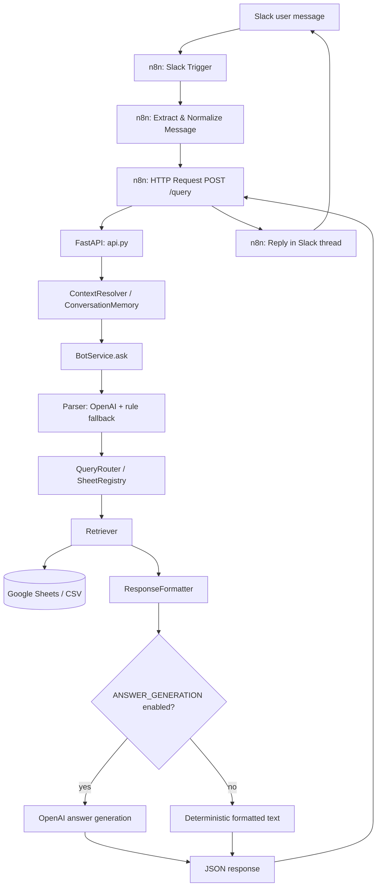

# Architecture — CPaaS Support Assistant

> See also: [PROJECT_OVERVIEW.md](./PROJECT_OVERVIEW.md) for the business context, [`registry/sheet_registry.py`](../registry/sheet_registry.py) for the code-level module map, [the API section of the README](../README.md#api) for the `/query` contract.

> **Demo build.** This repository is the public demo: it ships fictional CSV data and runs with no API keys. This document describes the full system, including the optional Google Sheets backend and Slack/n8n integration — neither of which is required to run the demo. See the [README](../README.md) for what is and isn't included here.

## 1. Overall System Architecture

```
Slack (user message)
      │
      ▼
   n8n  (Slack Trigger → extract message → HTTP Request → reply)
      │  POST /query  { "question": "...", "conversation_id": "<slack_user_id>" }
      │  Header: X-API-Key
      ▼
  FastAPI  (api.py)
      │
      ├─▶ ContextResolver + ConversationMemory   (rewrites follow-up questions)
      │
      ├─▶ BotService.ask()
      │     ├─▶ Parser (OpenAI, with rule-based fallback)   → ParsedQuery
      │     ├─▶ QueryRouter + SheetRegistry                  → SheetRoute
      │     ├─▶ Retriever + DataSource (Google Sheets/CSV)   → RetrievalResult
      │     └─▶ ResponseFormatter                            → deterministic text
      │
      └─▶ (optional) LLMAnswerGenerator (OpenAI)  → natural-language answer,
             grounded in the retrieved records; falls back to the
             formatter's deterministic text if generation is disabled
             or fails
      │
      ▼
  JSON response  { "answer": "...", "context_used": true|false }
      │
      ▼
     n8n  (posts `answer` back to Slack, in the originating thread)
      │
      ▼
    Slack (reply)
```

### Mermaid overview



## 2. Explaining Each Layer

### Slack
The end-user surface. Users message the bot directly or @-mention it in a channel. Slack delivers these as Events API webhooks.

### n8n
A thin **integration layer only** — see [§3](#3-why-n8n-is-only-an-integration-layer) for why. Its job is:
1. Receive the Slack event (Slack Trigger node).
2. Filter out the bot's own messages (to avoid loops) and strip the `<@BOTID>` mention token from the text.
3. Call `POST /query` on the FastAPI backend with `{"question": ..., "conversation_id": "<slack_user_id>"}` and an `X-API-Key` header.
4. Post the returned `answer` back to Slack in the same thread (`thread_ts`).
5. On any backend error, post a generic fallback message instead of failing silently.

### FastAPI (`api.py`)
The single source of truth for all business logic. Exposes two endpoints:
- `GET /health` — unauthenticated liveness check.
- `POST /query` — the one integration point any client (Slack via n8n, the dev frontend, or a future client) uses. Requires the `X-API-Key` header. See [the API section of the README](../README.md#api).

`api.py` itself only orchestrates: it resolves conversation context, calls `BotService.ask()`, updates conversation memory on success, optionally runs answer generation, and returns the response. It does not implement parsing, retrieval, or formatting itself — those live in `core/`, `parsers/`, `datasources/`, and `formatter.py`.

### OpenAI
Used in two independent places:
1. **Query parsing** (`parsers/llm_parser.py` → `llm/service.py`) — turns the raw question into a structured `ParsedQuery` (entity type, identifier, requested field, filters). Falls back to the offline rule parser if this fails (see [§5](#5-parser-fallback)).
2. **Answer generation** (`core/answer_generator.py` → `llm/service.py`) — optional; turns the retrieved records into a natural-language sentence. Controlled by `ANSWER_GENERATION` (default `true`). If disabled, unavailable (no API key), or the call fails, the deterministic `ResponseFormatter` output is used instead — the user always gets an answer either way.

### Google Sheets
The production data backend (`datasources/google_sheets_source.py`), read via a Google service account with `spreadsheets.readonly` scope. Data is organized into five logical "sheets" (`vmn`, `gateways`, `customers`, `tickets`, `source_information`), each resolved to a worksheet **tab** by trying a list of candidate tab names (so minor naming differences like "Gateway details" vs "Gateways" don't break the integration). Column headers are mapped to canonical field names via a per-sheet alias table, so header wording differences ("Account Name" vs "Company" vs "Company Name") all normalize to the same field (`company_name`). Results are cached in-process for `SHEETS_CACHE_TTL_SECONDS` (default 60s) per sheet to reduce API calls.

An equivalent CSV-backed implementation (`datasources/csv_source.py`) exists for local development and tests and implements the same `DataSource` interface — see [§6](#6-how-new-data-sources-can-be-added).

### Response
The FastAPI layer always returns structured JSON: `{"answer": "...", "context_used": true|false}`. This is true whether the query succeeded, found no records, or a recoverable error occurred (bad parse, unroutable entity type, retrieval error) — the user-facing `answer` field always carries a human-readable message. Only requests that fail authentication, fail request validation, or hit a genuinely unexpected server error return a non-200 status with a structured error body — see [the API section of the README](../README.md#api).

## 3. Why Business Logic Stays Inside FastAPI

All parsing, routing, retrieval, memory, and formatting logic lives in the Python backend (`core/`, `parsers/`, `datasources/`, `context/`, `formatter.py`), not in n8n, for concrete reasons:

- **Single source of truth.** The backend is independently testable (see `tests/`) and has an explicit, typed contract (`models.py`: `ParsedQuery`, `RetrievalResult`). Logic expressed as n8n nodes/expressions is much harder to unit test, code-review, or diff in version control.
- **Client independence.** Slack is the current production client, but the same `/query` endpoint already served the development React frontend and could serve a CLI (`app.py`) or a future client without any duplication of logic.
- **Consistency.** If routing rules, entity normalization, or answer formatting lived partly in n8n, behavior would diverge between clients (Slack vs. any future integration) and be far easier to get subtly wrong.

## 4. Why n8n Is Only an Integration Layer

n8n's responsibility is strictly: **Slack event in → HTTP call out → Slack reply**. It does not call OpenAI, does not read Google Sheets, and does not decide what an answer means — it only relays the `question`/`conversation_id` request and the `answer` response. This keeps n8n replaceable (any orchestration tool that can call a webhook and call an HTTP API could stand in for it) and keeps the backend the only place that needs to be correct, tested, and secured against the data sources.

## 5. Conversation Memory

Implemented in `context/memory.py`, used from `api.py`:

- **`ConversationMemory`** is an in-process dictionary keyed by `conversation_id` (the Slack user ID, passed through unchanged from n8n). For each conversation it stores only the **most recently referenced entity** — its type, value, the records last retrieved for it, and the last question asked.
- Entries expire after 30 minutes of inactivity (`TTL_SECONDS`) and the store is bounded to 500 concurrent conversations (`MAX_CONVERSATIONS`), evicting the oldest on overflow.
- **`ContextResolver`** runs *before* the parser sees the question. It decides whether a question is self-contained (contains a concrete identifier like a 10-digit number or `GW123`) or a follow-up:
  - Back-reference pronouns ("its", "it", "this gateway", "that number", "this one") are substituted with the last known entity value.
  - Short, bare field questions with no identifier ("Status?", "Who owns it?", "Which operator?") are prefixed with the last known entity ("Regarding number 9152001212: ...").
  - Questions that already contain a concrete identifier are left untouched, even if a previous entity is known.
- This means the parser and everything downstream always receives a fully self-contained question — memory resolution is invisible to the rest of the pipeline.

**Deployment caveat:** because this store is a plain in-process dict, it does **not** survive a backend restart and is **not** shared across multiple worker processes. Running `uvicorn` with more than one worker will cause intermittent loss of conversational context, since a follow-up request may be handled by a different worker than the one that saw the original message. See [DEPLOYMENT_GUIDE.md](./DEPLOYMENT_GUIDE.md) and [Production notes in the README](../README.md#production-notes).

## 6. Parser Fallback

`parsers/factory.py` builds a parser based on `PARSER_MODE` (`auto` | `openai` | `rule`) and whether `OPENAI_API_KEY` is set:

- **`rule`** — always uses `RuleBasedQueryParser` (`parsers/rule_parser.py`), a regex/keyword-based offline parser. No network calls.
- **`auto`** (default) or **`openai`** with a key configured — uses `HybridQueryParser`:
  1. Tries the OpenAI-backed `LLMQueryParser` first.
  2. If that raises a `ParserError` (OpenAI unreachable, malformed/low-confidence response, etc.), it automatically retries with `RuleBasedQueryParser`.
  3. If the rule parser also fails, the *original* LLM error is re-raised (so the user sees the more informative LLM-side error message rather than a generic rule-parser failure).
- **`auto` with no API key set** — uses `RuleBasedQueryParser` directly (no LLM attempt at all).

This means the assistant keeps working — in a reduced, keyword-matching capacity — even if OpenAI is down, misconfigured, or the API key is removed.

## 7. How New Data Sources Can Be Added

The data-access layer is deliberately isolated behind the abstract `DataSource` interface (`datasources/base.py`): `get_records(sheet_id)`, `find_records(sheet_id, column, value)`, and `filter_records(sheet_id, filters)`. `CSVDataSource` and `GoogleSheetsDataSource` both implement this interface, and `datasources/factory.py` selects between them via the `DATA_SOURCE` environment variable (`csv` or `google_sheets`). Nothing above this layer (`core/retriever.py`, `core/query_router.py`, `core/bot_service.py`) knows or cares which concrete backend is in use — they only work with logical `sheet_id` strings (`vmn`, `gateways`, `customers`, `tickets`, `source_information`).

To add a genuinely new backend (e.g. a SQL database), implement `DataSource` against it and register it in `datasources/factory.py` behind a new `DATA_SOURCE` value — no other file needs to change. See [`registry/sheet_registry.py`](../registry/sheet_registry.py) for the step-by-step for adding a new *sheet* or *entity type* on top of an existing backend, which is a distinct, more common task.
